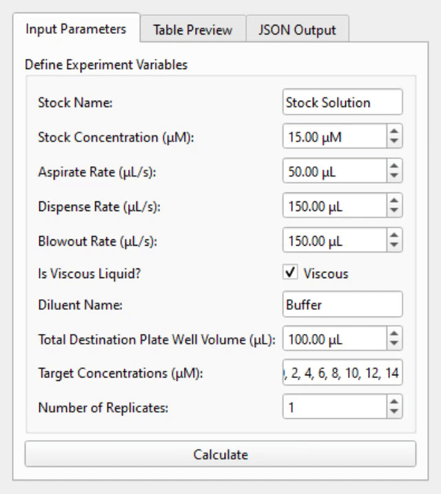
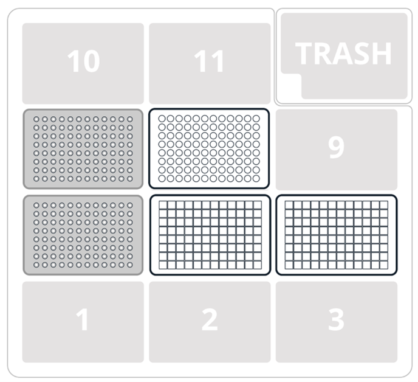
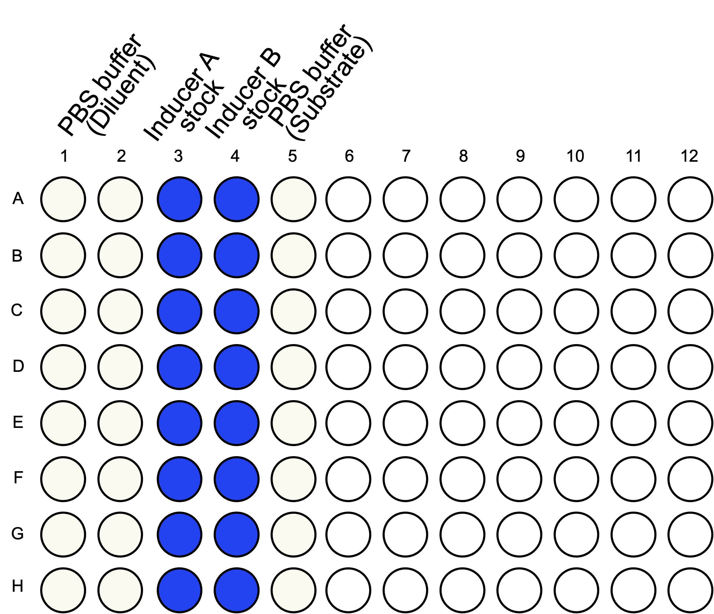
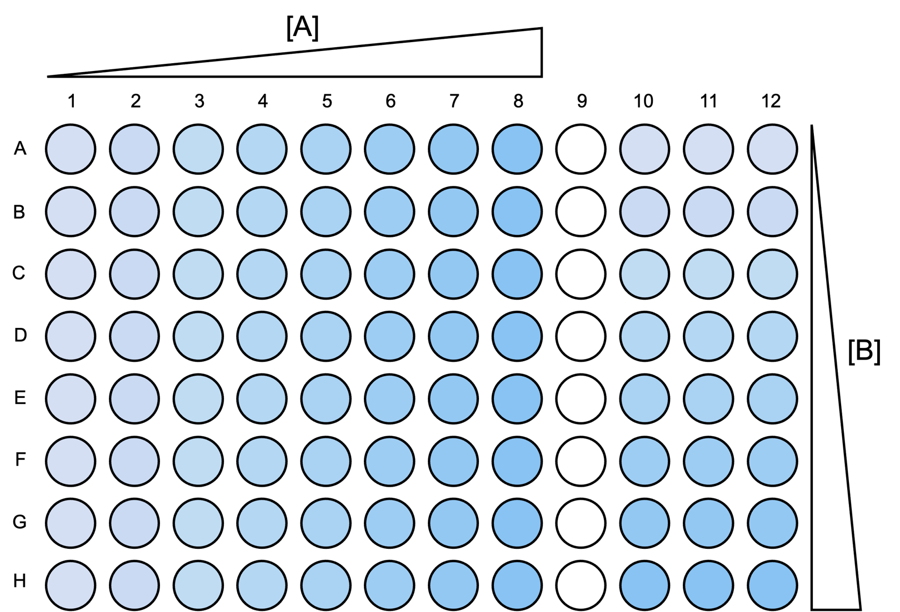
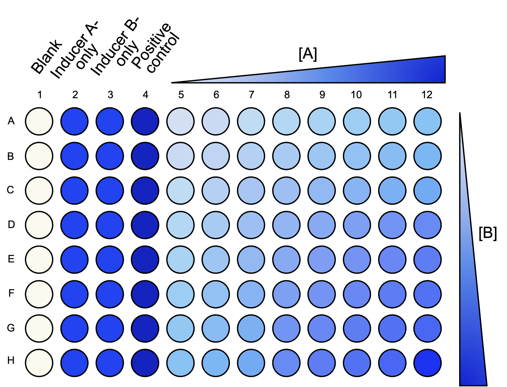
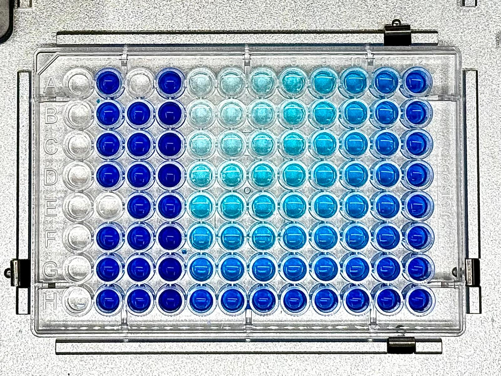

# Automating Dose-Response Experiment Generation using a GUI
## Overview
This protocol enables a customizable and automated setup of a 2D dose-response matrix assay using the Opentrons OT-2 robot. Users can specify concentration ranges, number of replicates (maximum 3 per run), and liquid viscosity in the user interface. User-defined parameters will be translated into the Opentrons script as a configuration. Before the actual run, the reservoir carrying the corresponding components has to be set up manually. The robot will first automatically generate the specified dilution series, then distribute each component combination into the appropriate wells. Pipetting flow rates will be adjusted dynamically according to liquid viscosities to minimise pipetting errors. This provides a flexible and robust platform for investigating combinatorial effects and characterizing logic architectures.  
## Prerequisites
This project relies on Conda for dependency management and environment isolation. Please ensure you have Anaconda or Miniconda installed on your system. 
### Environment Setup
1. Clone the repo
   ```sh
   git clone https://github.com/pacifistsilver/ot4_ssb.git
   ```
2. Create the environment and install dependencies
   ```sh
   conda env create -f environment.yml
   ```
3. Activate the environment
   ```sh
   conda activate opentron
   ```
### Opentrons Settings
This Opentrons script makes use of custom labware definitions: 
1. `4ti0136_96_wellplate_2200ul`.
2. `costar3370flatbottomtransparent_96_wellplate_200ul`. 

Ensure these are available in your labware directory prior to uploading your protocol, otherwise it will fail to analyse. 

We have used Opentrons API V2.0 at an apiLevel of 2.14 for the Opentrons script.
<!-- USAGE EXAMPLES -->
## Usage
### Execution:
1. Once the "opentrons" environment has been activated, you can run the below command in any suitable terminal or command line: 
   ```sh
   python main.py
   ```
   This will launch the GUI. From here, you can input your parameters and generate a config file for the opentrons protocols.
2. Default values are loaded initially in the "Input Parameters" tab. Any parameter can be altered under this tab, but the maximum value within the target concentration list must not exceed your inputted target concentration. 
3. In the tab "Table Preview", the dilution schedule can be viewed. 
4. If acceptable, you must click "Generate JSON". This will write a config file called `dilution_config.json` in the local directory of the `main.py` script. This is a required step.
6. Open the Opentrons GUI and set the directory of your custom labware definitions (`4ti0136_96_wellplate_2200ul` and `costar3370flatbottomtransparent_96_wellplate_200ul`) under the advanced settings tab under the Opentrons GUI settings.
7. Load this protocol and begin analysis.
8. Assuming all plates and calibrations have been set up, the script can begin execution!

### GUI Demo: 



### Our Experimental Run:
Users should prepare the reservoir according to their experimental design prior to the start of the Opentrons run. 
<p align="center">
   <figure>
      
<figcaption><b>Figure 1:</b> Opentrons deck layout for a single 2D dose-response matrix assay. Customized labware were used. Two opentrons_96_tiprack_300ul were placed in deck 4 and 7. 4ti0136_96_wellplate_2200ul in deck 5 and 6 were used as the reservoir and source plate respectively. costar3370flatbottomtransparent_96_wellplate_200ul in deck 8 was used as the destination plate.    </figcaption>
   </figure>
<br> 
<figure>
      
   <figcaption><b>Figure 2:</b> Reservoir layout for a single 2D dose-response matrix assay. Xylene cyanol was used as mimics for inducer A and B. PBS buffer was used as mimics for the diluent and assay substrate.   
   </figcaption>
</figure>
<figure>
   
   <figcaption><b>Figure 3:</b> Source plate layout for a single 2D dose-response matrix assay. A two-fold serial dilution of inducer A was performed from column 8 to 1, resulting in an increasing concentration gradient from column 1 to 8. A two-fold serial dilution of inducer B was performed from well H10 to A10, resulting in an increasing concentration gradient from row A to H. Columns 11 and 12 will be used for inducer B serial dilutions if more replicates are required. 
   </figcaption>
</figure>

<figure>
   
   <figcaption><b>Figure 4:</b> Destination plate layout for a 2D dose-response matrix assay. Columns 1-4 served as the blank and experimental controls. An increase in the concentration of inducer A from columns 5-12 was expected while an increase in concentration of inducer B from rows A to H was expected.
   </figcaption>
</figure>

<figure>
   
   <figcaption><b>Figure 5:</b> Imaged destination plate for a 2D dose-response matrix assay. Columns 1-4 served as the blank and experimental controls. Columns 5-12 were used for sample dyes. An "L-shaped" colouration can be observed for these samples as these have the highest concentration of dye. 
   </figcaption>
</figure>

</p>
<p align="right">(<a href="#Overview">back to top</a>)</p>

<!-- LICENSE -->
## License

Distributed under the MIT license. See `LICENSE.txt` for more information.

<p align="right">(<a href="#Overview">back to top</a>)</p>


<!-- CONTACT -->

## Authors
Code contributed by Agnes Cheung, Daniel Luo, Lihao Tao
<p align="right">(<a href="#Overview">back to top</a>)</p>
